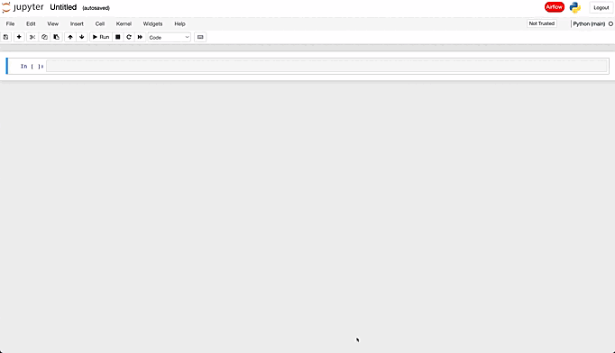
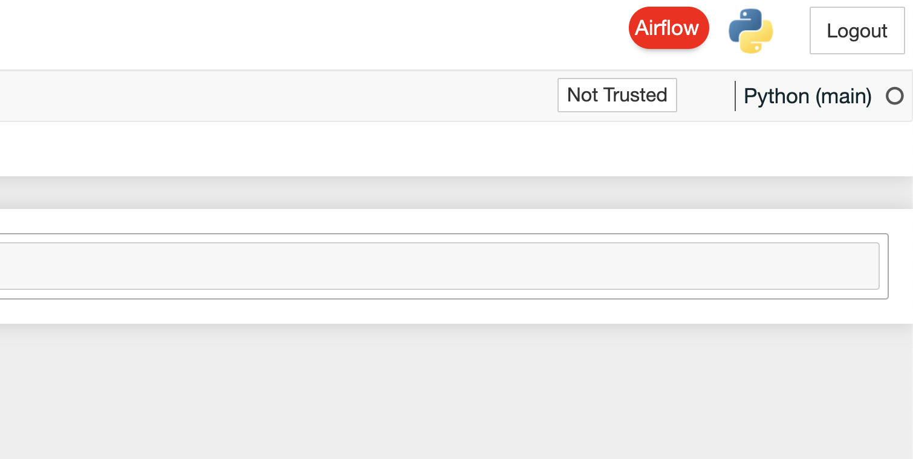
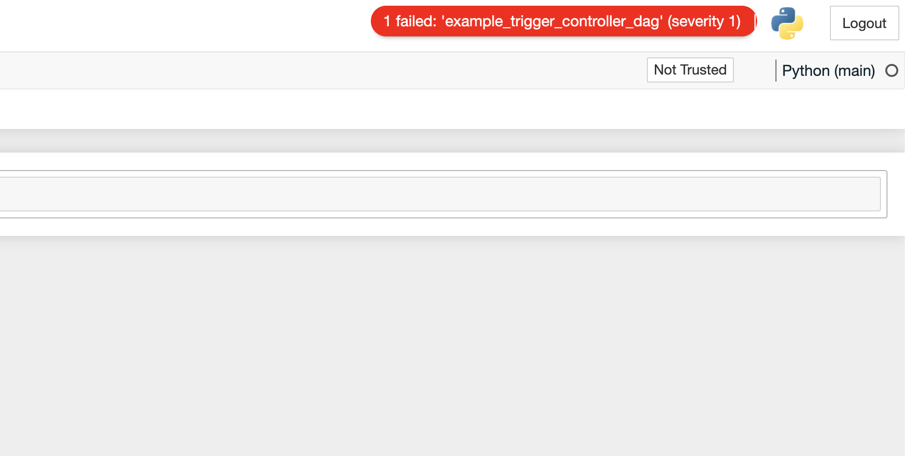
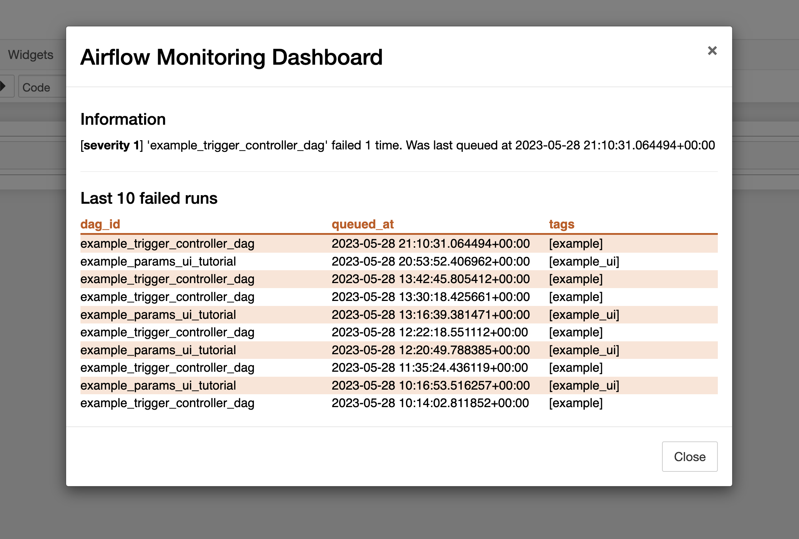

# Jupyter Airflow Monitoring

> :rotating_light: The project is in BETA, use with caution (see [TODOs](#todos)).



The Jupyter Airflow Monitoring project is a solution designed to monitor Apache Airflow's DAGs directly from your Jupyter environment. Its primary objective is to monitor only the DAGs you are interested in, and do it in a non-invasive way to avoid adding unnecessary friction. This project is particularly valuable for data scientists and developers who frequently work with Jupyter notebooks and want to keep an eye on their Airflow workflows.

## Table of content

1. [Why Jupyter Airflow Monitoring?](#why-jupyter-airflow-monitoring)
2. [Installation](#installation)
   1. [Method 1](#method-1)
   2. [Method 2](#method-2)
3. [/message Endpoint and Reverse Proxy](#message-endpoint-and-reverse-proxy)
    1. [The /message Endpoint](#the-message-endpoint)
    2. [You have a reverse proxy ?](#you-have-a-reverse-proxy)
4. [Usage in Airflow](#usage-in-airflow)
5. [Python API](#python-api)
6. [Using cURL/requests](#using-curl-requests)
   1. [Using cURL](#using-curl)
      1. [HTTP GET](#http-get)
      2. [HTTP POST](#http-post)
   2. [Using the python requests module](#using-the-python-requests-module)
7. [Screenshots](#screenshots)
8. [Contributing](#contributing)
9. [TODOs](#todos)
10. [License](#license)

## Why Jupyter Airflow Monitoring?

While working with Airflow, it can be somewhat challenging to monitor the status of your DAGs, especially when you only need to track specific DAGs. This project proposes a solution for this problem by providing a way to specify tags for the DAGs you want to monitor and their corresponding severity levels if a DAG with the specified tag fails. This feature allows for customized and focused monitoring of your Airflow workflows. 

## Installation

> :warning: **CAUTION BETA**: This is a beta version (might not be secure!). Use it at your own risks.

> **KNOWN LIMITATIONS**: Please note that the current version of this project is limited to systems where both Airflow and Jupyter are running on the same host. *Additionally*, it is only compatible with Airflow standalone installations. It is theoretically possible to install it on a dockerized airflow with a shared volume though but I didn't try yet (you would need to install the module on both the host and the airflow image). 
__I plan on adding more flexibility/features in the future.__ See the [TODOs list](#todos).

To install this project, there are two methods:

### Method 1
1. Clone the repo
```bash
git clone https://github.com/EmileDqy/jupyter_airflow_monitoring.git
cd jupyter_airflow_monitoring
```

2. Install using the `install.sh` script
```bash
./install.sh
```

### Method 2
1. Clone the repo
```bash
git clone https://github.com/EmileDqy/jupyter_airflow_monitoring.git
cd jupyter_airflow_monitoring
```

2. Install using pip:
```bash
pip install .
```

3. Use the Jupyter CLI to enable the extension:

```bash
jupyter nbextension install --py --symlink --sys-prefix jupyter_airflow_monitoring
jupyter nbextension enable jupyter_airflow_monitoring --py --sys-prefix
jupyter serverextension enable jupyter_airflow_monitoring --py 
```

For your convenience, we also provide an `install.sh` script that will carry out the steps mentioned above.

## /message Endpoint and Reverse Proxy

### The /message Endpoint

After installation, you'll be able to interact with the `/message` endpoint. This endpoint allows setting and getting messages related to your monitored DAGs.

### You have a Reverse Proxy?

When operating the Jupyter server behind a reverse proxy, it's crucial to configure the proxy correctly to ensure seamless connectivity between the frontend and the `/message` endpoint. Without the proper configuration, the frontend may encounter difficulties connecting to the backend, rendering the endpoint inaccessible. Ensure that your reverse proxy setup includes the necessary rules and configurations to allow communication with the `/message` endpoint. This ensures the proper functioning of the monitoring system.

## Usage in Airflow

Once the extension is installed, an operator `DagsMonitoringOperator` is made available which can be used to create a DAG. This DAG is then scheduled to run at your preferred frequency (e.g., hourly) to monitor your DAGs.

Here is an example:

```python
# Import the new Operator
from jupyter_airflow_monitoring.operator import DagsMonitoringOperator
from airflow import models
import pendulum

with models.DAG(
    dag_id="monitoring",
    schedule="@hourly", # Check every hour
    start_date=pendulum.datetime(2023, 1, 1, tz="UTC"),
    catchup=False,
) as dag:
    task = DagsMonitoringOperator(
        task_id="monitoring", 
        monitored_tags_severity={
            "example": 1, # All dags with tag 'example' will have severity=1 (red) when they fail
            "something": 2 # Severity = 2 (orange)
            "example_ui": 3 # Severity = 3 (yellow)
        }
    )
    task
```

In this example, the DAG with the id `monitoring2` is scheduled to run hourly, starting from January 1, 2021. The `DagsMonitoringOperator` monitors the DAGs with the tags "example" and "example_ui", with corresponding severity levels of 1 and 3.

## Python API

In addition to the operator, the project also exposes a Python API that allows setting and getting messages related to the monitored DAGs. This can be useful for more fine-grained control or custom integrations. Here is how you can use it:

```python
from jupyter_airflow_monitoring import set_message, get_message

# Set a message
set_message("DAG Failed", "MyDAG", "#FF0000")

# Get the message
message = get_message()
```

## Using cURL/requests

> Caution: This might not be the most ideal and secure way to interact with the endpoint because it requires you to manually get the session token and store it...

In order to do that, you will need to **get the session token** from the jupyter server.

It usually looks something like this in the log but you can also fetch it directly from the frontend once connected:
```log
[I 10:36:26.674 NotebookApp] Serving notebooks from local directory: /path/to/folder/
[I 10:36:26.674 NotebookApp] Jupyter Notebook 6.5.4 is running at:
[I 10:36:26.674 NotebookApp] http://localhost:8888/?token=<token>
[I 10:36:26.674 NotebookApp]  or http://127.0.0.1:8888/?token=<token>
[I 10:36:26.674 NotebookApp] Use Control-C to stop this server and shut down all kernels (twice to skip confirmation).
```

Once you have the token, you can interact with the **/message** endpoint:

### Using cURL
#### HTTP GET
To get the current message (used by the frontend):
```bash
curl -H "Authorization: token <token>" http://localhost:8888/message
```

#### HTTP POST
To set a new message (currently just implemented but not in use):
```bash
curl -X POST -H "Authorization: token <token>" -H "Content-Type: application/json" -d '{"message": "Hello", "title": "Test", "color": "red"}' http://localhost:8888/message
```

### Using the python requests module

```python
import requests
import json

token = "<your_token>"
headers = {
    "Authorization": f"token {token}"
}

# GET request
response = requests.get("http://localhost:8888/message", headers=headers)
print(response.json())

# POST request
data = {
    "message": "Hello",
    "title": "Test",
    "color": "red"
}
response = requests.post("http://localhost:8888/message", headers=headers, data=json.dumps(data))
print(response.json())
```

## Screenshots


##### When a DAG with a severity 1 fails:
Default view:


On mouse hover:


On click:



## Contributing

Contributions to this project are welcome! Please feel free to submit a Pull Request or open an issue on GitHub if you encounter any problems or have suggestions for improvements. Please note that I'm fairly new to jupyter extension development.

## TODOs

0) Implement a more secure way of storing the /message data (the contect fetched and sent back): currently using a file in the /tmp ... not ideal. Also, the data is currently pre-rendered which is not good and secure at all. Sanitizing and processing the data is the next dev.
1) Add support for windows based systems
2) Add support for dockerized airflow
3) Add option to use a connexion so that the airflow operator can communicate with the jupyter server (airflow on a different system than the jupyter server)
4) Add monitoring by dag_id
5) Add monitoring automatic: run when a tracked DAG finished

## License

This project is licensed under the terms of the Apache-2.0 license.

I hope that this project helps improve your workflow and productivity.